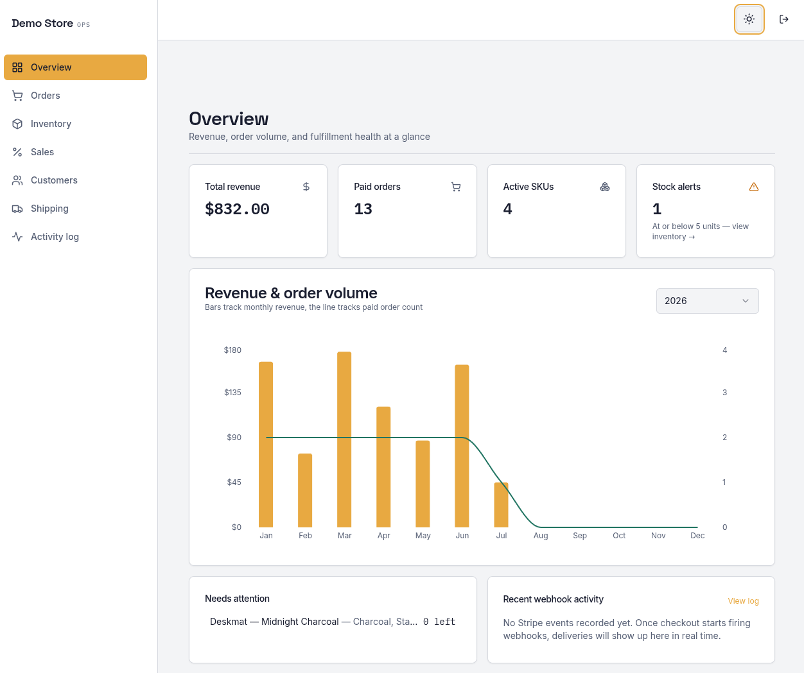
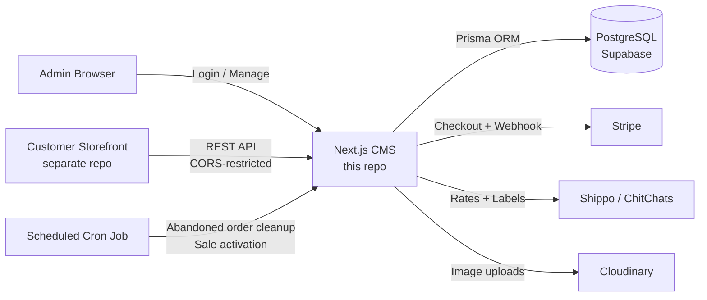

# Stockroom

Self-hosted e-commerce CMS

[](https://github.com/macsampson/stockroom/actions/workflows/ci.yml)
[](https://github.com/macsampson/stockroom/actions/workflows/codeql.yml)
[](LICENSE)
<a href="https://stockroom-demo.vercel.app/login" target="_blank" rel="noopener noreferrer"></a>

A self-hosted admin dashboard for running an online store, built as an alternative to paying Etsy/Shopify's monthly and transaction fees. Full multi-store product management, Stripe payments, and live shipping-rate/label integrations with Shippo and ChitChats.


_Dashboard overview: revenue and order volume, inventory alerts, and Stripe webhook activity at a glance_


## 🔗 Live Demo

**<a href="https://stockroom-demo.vercel.app/login" target="_blank" rel="noopener noreferrer">stockroom-demo.vercel.app</a>**


## Contents

- [Why This Project?](#why-this-project)
- [Features](#features)
- [Tech Stack](#tech-stack)
- [Architecture](#architecture)
- [Testing & CI](#testing--ci)
- [Security](#security)
- [Getting Started](#getting-started)
  - [Quick Start](#quick-start)
  - [Environment Configuration](#environment-configuration)
  - [Setup Guide](#setup-guide)
  - [Production Checklist](#production-checklist)
- [Roadmap / Planned](#roadmap--planned)

## Why This Project?

I was tired of paying monthly fees and per-transaction cuts to Etsy and Shopify, so I built this instead. It gives you:

- **Complete ownership** of your store and customer data
- **Zero monthly fees** — host it yourself or deploy for free on Vercel
- **No transaction limits** — keep 100% of your profits (minus payment processing)
- **Full customization** — modify anything to fit your brand
- **Multi-store capability** — run multiple brands from one installation

## Features

**Store & Product Management**
- Multiple stores from a single dashboard
- Products with variations (size/color), image galleries via Cloudinary, categories
- Quantity-based bundle discounts
- Time-boxed sales and promotions (store-wide or per-product), auto activated/deactivated on a schedule

**Payments & Orders**
- Stripe Checkout integration with signature-verified webhook fulfillment
- Order lifecycle tracking, abandoned-order cleanup with automatic inventory release
- Automated inventory decrement/increment on purchase and cancellation

**Shipping & Fulfillment**
- Live shipping rate calculation and label generation via Shippo and ChitChats
- Address validation and customs declarations for international orders
- Multi-currency support with stored live exchange rates

**Analytics**
- Revenue, sales, and stock overview widgets on the dashboard

## Tech Stack

- **Framework**: Next.js 16 (App Router), TypeScript
- **Database**: PostgreSQL via Prisma (Neon Postgres auto-provisioned by the Deploy to Vercel button; Supabase or any Postgres instance also supported)
- **Auth**: Single-admin session auth with `iron-session` (encrypted, cookie-based) + bcrypt
- **Payments**: Stripe
- **Shipping**: Shippo & ChitChats APIs
- **Images**: Cloudinary
- **UI**: Tailwind CSS, shadcn/ui (Radix primitives), Zustand, React Hook Form + Zod
- **Logging**: Structured JSON logs via `pino` on the API layer
- **Testing**: Jest
- **CI/CD**: GitHub Actions — lint, typecheck, test, build gate deploy; CodeQL + Dependabot for security scanning

## Architecture



The CMS exposes a store-scoped REST API (`/api/[storeId]/...`) that the separate storefront app consumes; `middleware.ts` enforces CORS against an allow-list for those routes while the dashboard itself sits behind session auth. Stripe webhooks create orders and decrement inventory; a cron job (`app/api/cron`) periodically releases inventory held by abandoned checkouts and flips sales in/out of `active` based on their scheduled dates.

## Testing & CI

```bash
npm test          # Jest suite
npm run lint       # ESLint
npm run typecheck  # tsc --noEmit
```

Tests concentrate on the money-critical paths most likely to break silently: the Stripe webhook's order-creation/inventory-decrement flow (including idempotency — a redelivered webhook event can't create a duplicate order), and the read-side summary/revenue endpoints. CI (GitHub Actions) runs lint, typecheck, tests, and a production build on every push and PR to `main`, and gates deployment on all of them passing. CodeQL and Dependabot run on a schedule for security/dependency scanning.

## Security

- Session-based auth with encrypted, `httpOnly` cookies (`iron-session`)
- Stripe webhook signatures verified before processing any order, with idempotency handling so a redelivered event can't create a duplicate order or double-decrement inventory
- SQL injection protection via Prisma's parameterized queries
- Passwords hashed with bcrypt; admin account created via a first-run `/setup` screen and stored in the database (env-var-based credentials still supported for legacy/scripted setups), never committed
- CORS allow-list (`ALLOWED_ORIGINS`) restricting which origins can call the store-scoped API
- Rate limiting on login and checkout (in-memory, per-IP — see [lib/rate-limit.ts](lib/rate-limit.ts) for the tradeoffs of that approach on serverless)

---

## Getting Started

### Quick Start

#### Option 1: Deploy to Vercel

[](https://vercel.com/new/clone?repository-url=https%3A%2F%2Fgithub.com%2Fmacsampson%2Fstockroom&project-name=stockroom&repository-name=stockroom&products=%5B%7B%22type%22%3A%22integration%22%2C%22integrationSlug%22%3A%22neon%22%2C%22productSlug%22%3A%22neon%22%2C%22protocol%22%3A%22storage%22%7D%5D&env=STRIPE_API_KEY%2CSTRIPE_WEBHOOK_SECRET%2CNEXT_PUBLIC_STRIPE_PUBLISHABLE_KEY%2CNEXT_PUBLIC_CLOUDINARY_CLOUD_NAME%2CALLOWED_ORIGINS&envDescription=Stripe+keys%2C+Cloudinary+cloud+name%2C+and+allowed+storefront+origins+-+see+the+Setup+Guide+below+for+where+to+get+each+one.+Admin+login+is+created+after+deploy+at+%2Fsetup%2C+not+here.&envLink=https%3A%2F%2Fgithub.com%2Fmacsampson%2Fstockroom%23setup-guide)

1. Click "Deploy with Vercel" and connect your GitHub
2. Vercel provisions a Neon Postgres database for you automatically (no separate Supabase/Neon account needed) and sets `DATABASE_URL`/`DATABASE_URL_UNPOOLED`
3. You'll be prompted right there in the deploy flow for the remaining required values: Stripe keys, Cloudinary cloud name, and `ALLOWED_ORIGINS` — see the [Setup Guide](#setup-guide) below for where to get each one
4. Database migrations run automatically as part of the Vercel build (see `vercel.json`'s `buildCommand`) — nothing to run by hand
5. Visit your deployed URL — you'll land on `/setup` to create your admin email and password right in the browser (no hash-generating scripts, no env vars to hand-edit); after that you're logged in and prompted to create your first store
6. Your CMS is live — see the [Production Checklist](#production-checklist) before pointing real customers at it

> Prefer Supabase, or already have a Postgres instance? Skip the bundled database prompt in the deploy flow and set `DATABASE_URL`/`DIRECT_URL` yourself instead — see [Database](#1-database) below.

#### Option 2: Local Development

```bash
git clone https://github.com/macsampson/stockroom
cd stockroom

npm install

# Set up environment variables
cp .env.example .env.local
# Edit .env.local with your configuration — admin credentials aren't set here,
# see below

npm run dev:docker

# Optional: seed sample products/categories so the dashboard isn't empty
npm run seed-dev
```

`npm run dev:docker` spins up a local Postgres via Docker Compose, runs migrations, and starts the dev server — no Supabase account needed. If you'd rather use the Supabase CLI (matches the hosted setup more closely), run `supabase start && npx prisma migrate deploy` instead, then `npm run dev`.

Visit `http://localhost:3000` — on a fresh database you'll land on `/setup` to create your admin email and password (this only happens once; the account is stored in the database, not env vars). After that you're logged in and prompted to create your first store; run `npm run seed-dev` beforehand if you'd rather start from sample data instead of an empty store.

### Environment Configuration

Create a `.env.local` file with these variables:

```env
# Database (Supabase)
DATABASE_URL="postgresql://..."
DIRECT_URL="postgresql://..."

# Admin Authentication — usually not needed. Visit /setup on first run to
# create your admin account and session secret right in the browser; they're
# stored in the database, not here. These env vars are a legacy fallback for
# scripting/CI use — see Setup Guide below.
# ADMIN_EMAIL="your-email@example.com"
# ADMIN_PASSWORD_HASH="$2b$12$..."
# SESSION_SECRET="your-32-character-secret-key-here"

# Local dev only — skips the login gate. Leave unset in every real
# deployment; auth is enforced by default (see Production Checklist below)
DISABLE_AUTH_FOR_LOCAL_DEV="true"

# Stripe Payments
STRIPE_API_KEY="sk_..."
STRIPE_WEBHOOK_SECRET="whsec_..."
NEXT_PUBLIC_STRIPE_PUBLISHABLE_KEY="pk_..."

# Image Storage (Cloudinary)
NEXT_PUBLIC_CLOUDINARY_CLOUD_NAME="your-cloud-name"

# API Configuration
ALLOWED_ORIGINS="https://yourdomain.com,https://yourstore.com"

# Optional: Shipping & exchange rate APIs
SHIPPO_API_KEY=""
CHITCHATS_API_KEY=""
EXCHANGE_RATE_API_KEY=""
```

### Setup Guide

**1. Database**

**Deploy to Vercel button (default):** a Neon Postgres database is provisioned for you automatically, with `DATABASE_URL`/`DATABASE_URL_UNPOOLED` set in your Vercel project already — nothing to create by hand. Migrations run automatically on every Vercel build (`vercel.json`'s `buildCommand` runs `prisma migrate deploy` before `next build`), including preview deployments — it's a no-op if there's nothing new to apply, so this is safe to leave as-is.

**Supabase:** create a project at [supabase.com](https://supabase.com), copy the database URLs into `DATABASE_URL`/`DIRECT_URL` in your Vercel project. Migrations still run automatically on deploy via the same `buildCommand`.

**Self-hosted PostgreSQL:** point `DATABASE_URL`/`DIRECT_URL` at your own instance. If you're not deploying through Vercel's build (e.g. Docker/bare metal), run `npm run deploy` yourself before starting the app.

**2. Authentication**

Visit `/setup` on your deployed URL (or `http://localhost:3000` locally) the first time — it's a plain form for an admin email and password. Submitting it creates the admin account and a random session-encryption secret in the database, and logs you straight in. `/setup` only works once; visiting it again after an admin exists redirects to `/login`.

This app is single-admin: one account, no invite flow, no user table beyond that single row. There is intentionally no in-app way to change the email/password later — to reset lost credentials, delete the row from the `admin_user` table and revisit `/setup`.

**Legacy / scripted setups:** you can still configure the admin via `ADMIN_EMAIL` + `ADMIN_PASSWORD_HASH` + `SESSION_SECRET` env vars instead (useful for CI or infra-as-code) — set all three and `/setup` is skipped automatically in favor of them. Generate the hash with `node scripts/set-admin-password.js` (writes `ADMIN_PASSWORD_HASH` straight into `.env.local`, correctly escaped — Next.js's env loader expands `$`-prefixed sequences, which silently corrupts a hand-pasted bcrypt hash).

**3. Payments**

Create a [Stripe](https://stripe.com) account, grab your API keys, and set up a webhook endpoint at `https://yourdomain.com/api/webhook` listening for `checkout.session.completed`.

**4. Images**

Create a [Cloudinary](https://cloudinary.com) account (free tier available) and set `NEXT_PUBLIC_CLOUDINARY_CLOUD_NAME`.

### Production Checklist

- [ ] `DISABLE_AUTH_FOR_LOCAL_DEV` is **not** set (the login gate is bypassed if it's `"true"` — verify with `curl -I https://yourdomain.com/` shouldn't redirect anywhere without a session; hitting `/[storeId]` unauthenticated should redirect to `/login`)
- [ ] Production database configured (Neon/Supabase/PostgreSQL) — migrations apply automatically on every Vercel build, including previews, so make sure preview deployments aren't pointed at a database you don't want auto-migrated
- [ ] Admin account created via `/setup` (or `SESSION_SECRET`/`ADMIN_EMAIL`/`ADMIN_PASSWORD_HASH` set, for legacy env-var-based setups)
- [ ] Stripe webhook endpoint configured
- [ ] Cloudinary configured for image storage
- [ ] `ALLOWED_ORIGINS` set for your storefront domain(s)
- [ ] Payment flow tested end-to-end
- [ ] SSL certificate configured
- [ ] Backup strategy in place for the database

## Roadmap / Planned

- Proper drag-to-reorder for billboard carousel images (currently unordered)
- Loading skeleton components in place of plain "Loading..." states

## License

[MIT](LICENSE)

