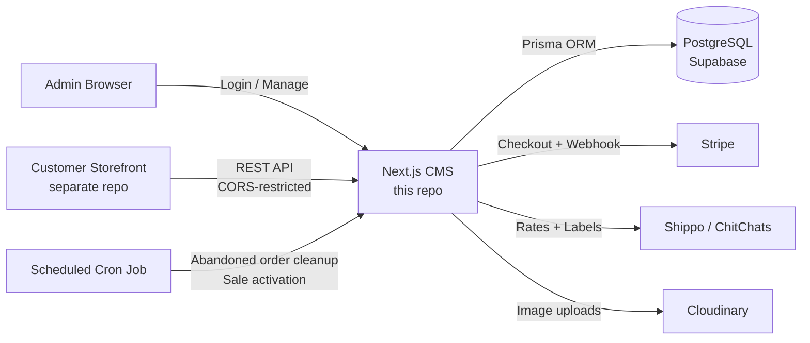

# 🛒 Self-Hosted E-Commerce CMS

[](https://github.com/macsampson/ecommerce-cms/actions/workflows/ci.yml)
[](LICENSE)

A self-hosted admin dashboard for running an online store, built as an alternative to paying Etsy/Shopify's monthly and transaction fees. Full multi-store product management, Stripe payments, and live shipping-rate/label integrations with Shippo and ChitChats.


_Demo: managing products, orders, and billboards from the dashboard_

> **Note:** This repo is the CMS/admin side of the platform — the customer-facing storefront that reads from this API lives in a separate repository.

## Why This Project?

I was tired of paying monthly fees and per-transaction cuts to Etsy and Shopify, so I built this instead. It gives you:

- **Complete ownership** of your store and customer data
- **Zero monthly fees** — host it yourself or deploy for free on Vercel
- **No transaction limits** — keep 100% of your profits (minus payment processing)
- **Full customization** — modify anything to fit your brand
- **Multi-store capability** — run multiple brands from one installation

## Features

**Store & Product Management**
- Multiple stores from a single dashboard
- Products with variations (size/color), image galleries via Cloudinary, categories
- Quantity-based bundle discounts
- Time-boxed sales and promotions (store-wide or per-product), auto activated/deactivated on a schedule

**Payments & Orders**
- Stripe Checkout integration with signature-verified webhook fulfillment
- Order lifecycle tracking, abandoned-order cleanup with automatic inventory release
- Automated inventory decrement/increment on purchase and cancellation

**Shipping & Fulfillment**
- Live shipping rate calculation and label generation via Shippo and ChitChats
- Address validation and customs declarations for international orders
- Multi-currency support with stored live exchange rates

**Analytics**
- Revenue, sales, and stock overview widgets on the dashboard

## Tech Stack

- **Framework**: Next.js 14 (App Router), TypeScript
- **Database**: PostgreSQL via Prisma (Supabase recommended)
- **Auth**: Single-admin session auth with `iron-session` (encrypted, cookie-based) + bcrypt
- **Payments**: Stripe
- **Shipping**: Shippo & ChitChats APIs
- **Images**: Cloudinary
- **UI**: Tailwind CSS, shadcn/ui (Radix primitives), Zustand, React Hook Form + Zod
- **Testing**: Jest
- **CI**: GitHub Actions (lint, typecheck, test, build)

## Architecture



The CMS exposes a store-scoped REST API (`/api/[storeId]/...`) that the separate storefront app consumes; `middleware.ts` enforces CORS against an allow-list for those routes while the dashboard itself sits behind session auth. Stripe webhooks create orders and decrement inventory; a cron job (`app/api/cron`) periodically releases inventory held by abandoned checkouts and flips sales in/out of `active` based on their scheduled dates.

## Quick Start

### Option 1: Deploy to Vercel

[](https://vercel.com/new/clone?repository-url=https://github.com/macsampson/ecommerce-cms)

1. Click "Deploy with Vercel" and connect your GitHub
2. Set up a Supabase database (free tier available)
3. Configure environment variables in Vercel (see below)
4. Your CMS will be live in minutes

### Option 2: Local Development

```bash
git clone https://github.com/macsampson/ecommerce-cms
cd ecommerce-cms

npm install

# Set up environment variables
cp .env.example .env.local
# Edit .env.local with your configuration

# Set up the database
supabase start
npx prisma migrate deploy

# Generate an admin password hash
node scripts/generate-password-hash.js

npm run dev
```

Visit `http://localhost:3000/login` to access the admin dashboard.

## Testing

```bash
npm test        # run the Jest suite
npm run lint     # ESLint
npm run typecheck # tsc --noEmit
```

Tests cover the money-critical paths most likely to break silently: the Stripe webhook order-creation/inventory-decrement flow, and the read-side summary/revenue endpoints. CI runs lint, typecheck, tests, and a production build on every push and PR to `main`.

## Environment Configuration

Create a `.env.local` file with these variables:

```env
# Database (Supabase)
DATABASE_URL="postgresql://..."
DIRECT_URL="postgresql://..."

# Admin Authentication
ADMIN_EMAIL="your-email@example.com"
ADMIN_PASSWORD_HASH="$2b$12$..." # Generate with scripts/generate-password-hash.js
SESSION_SECRET="your-32-character-secret-key-here"

# Stripe Payments
STRIPE_API_KEY="sk_..."
STRIPE_WEBHOOK_SECRET="whsec_..."
NEXT_PUBLIC_STRIPE_PUBLISHABLE_KEY="pk_..."

# Image Storage (Cloudinary)
NEXT_PUBLIC_CLOUDINARY_CLOUD_NAME="your-cloud-name"

# API Configuration
ALLOWED_ORIGINS="https://yourdomain.com,https://yourstore.com"

# Optional: Shipping & exchange rate APIs
SHIPPO_API_KEY=""
CHITCHATS_API_KEY=""
EXCHANGE_RATE_API_KEY=""
```

## Setup Guide

### 1. Database

**Supabase (recommended):** create a project at [supabase.com](https://supabase.com), copy the database URLs into your env vars, then run `npx prisma migrate deploy`.

**Self-hosted PostgreSQL:** point `DATABASE_URL`/`DIRECT_URL` at your own instance and run the same migration command.

### 2. Authentication

```bash
node scripts/generate-password-hash.js
# Enter your desired password, copy the hash to ADMIN_PASSWORD_HASH
```

This app is single-admin: one email + password hash configured via environment variables, not a user table.

### 3. Payments

Create a [Stripe](https://stripe.com) account, grab your API keys, and set up a webhook endpoint at `https://yourdomain.com/api/webhook` listening for `checkout.session.completed`.

### 4. Images

Create a [Cloudinary](https://cloudinary.com) account (free tier available) and set `NEXT_PUBLIC_CLOUDINARY_CLOUD_NAME`.

## Production Checklist

- [ ] Production database configured (Supabase/PostgreSQL)
- [ ] `SESSION_SECRET` set to a secure 32+ character value
- [ ] Stripe webhook endpoint configured
- [ ] Cloudinary configured for image storage
- [ ] `ALLOWED_ORIGINS` set for your storefront domain(s)
- [ ] Payment flow tested end-to-end
- [ ] SSL certificate configured
- [ ] Backup strategy in place for the database

## Security Notes

- Session-based auth with encrypted, `httpOnly` cookies (`iron-session`)
- Stripe webhook signatures verified before processing any order
- SQL injection protection via Prisma's parameterized queries
- Passwords hashed with bcrypt; credentials configured via environment variables, never committed
- CORS allow-list (`ALLOWED_ORIGINS`) restricting which origins can call the store-scoped API

## Roadmap / Planned

- Proper drag-to-reorder for billboard carousel images (currently unordered)
- Loading skeleton components in place of plain "Loading..." states
- Rate limiting on public-facing endpoints

## License

[MIT](LICENSE)
