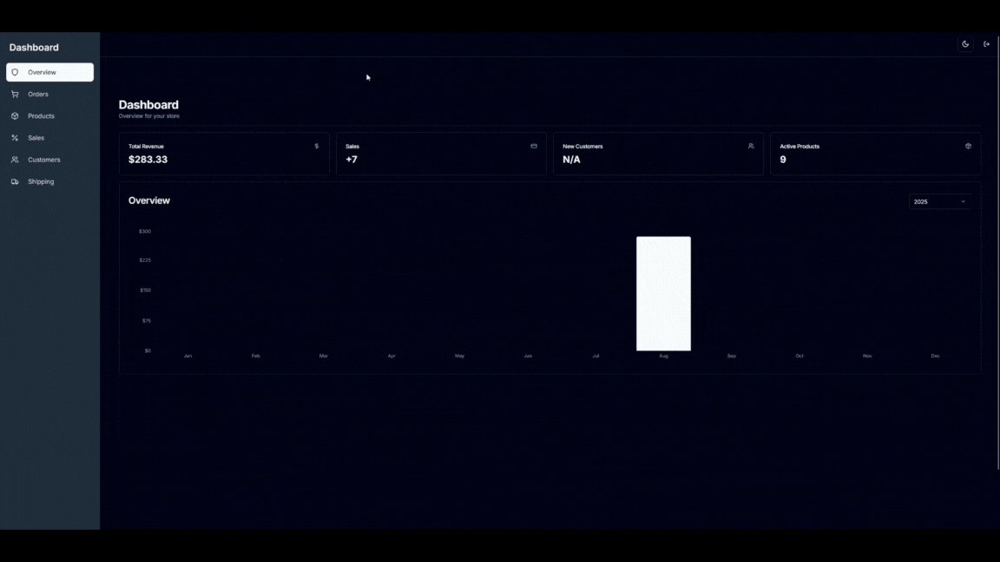
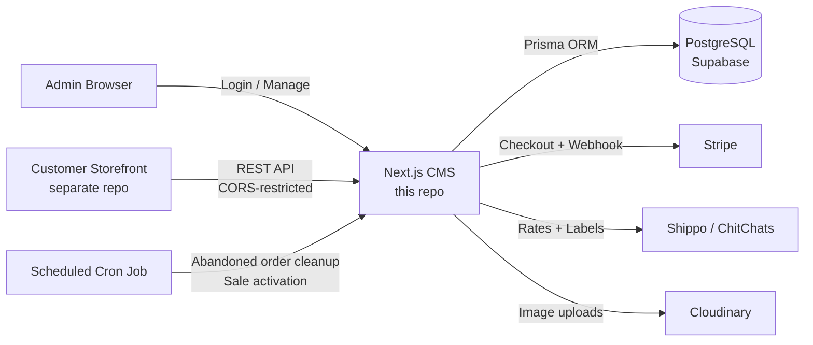

# 🛒 Self-Hosted E-Commerce CMS

[](https://github.com/macsampson/ecommerce-cms/actions/workflows/ci.yml)
[](LICENSE)
[](https://pocketcaps-cms-demo.vercel.app/login)

A self-hosted admin dashboard for running an online store, built as an alternative to paying Etsy/Shopify's monthly and transaction fees. Full multi-store product management, Stripe payments, and live shipping-rate/label integrations with Shippo and ChitChats.


_Demo: managing products, orders, and billboards from the dashboard_

> **Note:** This repo is the CMS/admin side of the platform — the customer-facing storefront that reads from this API lives in a separate repository.

## 🔗 Live Demo

**[pocketcaps-cms-demo.vercel.app](https://pocketcaps-cms-demo.vercel.app/login)** — log in with `demo@example.com` / `Demo-558383d8!`

This is a separate, dedicated demo deployment with its own seeded database — not the deployment that ran the real business. It runs in **read-only demo mode**: browse the full dashboard with real seeded data (products, orders, customers, a populated revenue graph), but every write request (create/edit/delete) is rejected at the middleware level so the demo can't be broken by visitors. See [Demo Mode](#demo-mode) for how that works.

## Contents

- [Why This Project?](#why-this-project)
- [Features](#features)
- [Tech Stack](#tech-stack)
- [Architecture](#architecture)
- [Testing & CI](#testing--ci)
- [Security](#security)
- [Getting Started](#getting-started)
  - [Quick Start](#quick-start)
  - [Environment Configuration](#environment-configuration)
  - [Setup Guide](#setup-guide)
  - [Demo Mode](#demo-mode)
  - [Production Checklist](#production-checklist)
- [Roadmap / Planned](#roadmap--planned)

## Why This Project?

I was tired of paying monthly fees and per-transaction cuts to Etsy and Shopify, so I built this instead. It gives you:

- **Complete ownership** of your store and customer data
- **Zero monthly fees** — host it yourself or deploy for free on Vercel
- **No transaction limits** — keep 100% of your profits (minus payment processing)
- **Full customization** — modify anything to fit your brand
- **Multi-store capability** — run multiple brands from one installation

## Features

**Store & Product Management**
- Multiple stores from a single dashboard
- Products with variations (size/color), image galleries via Cloudinary, categories
- Quantity-based bundle discounts
- Time-boxed sales and promotions (store-wide or per-product), auto activated/deactivated on a schedule

**Payments & Orders**
- Stripe Checkout integration with signature-verified webhook fulfillment
- Order lifecycle tracking, abandoned-order cleanup with automatic inventory release
- Automated inventory decrement/increment on purchase and cancellation

**Shipping & Fulfillment**
- Live shipping rate calculation and label generation via Shippo and ChitChats
- Address validation and customs declarations for international orders
- Multi-currency support with stored live exchange rates

**Analytics**
- Revenue, sales, and stock overview widgets on the dashboard

## Tech Stack

- **Framework**: Next.js 14 (App Router), TypeScript
- **Database**: PostgreSQL via Prisma (Supabase recommended)
- **Auth**: Single-admin session auth with `iron-session` (encrypted, cookie-based) + bcrypt
- **Payments**: Stripe
- **Shipping**: Shippo & ChitChats APIs
- **Images**: Cloudinary
- **UI**: Tailwind CSS, shadcn/ui (Radix primitives), Zustand, React Hook Form + Zod
- **Logging**: Structured JSON logs via `pino` on the API layer
- **Testing**: Jest
- **CI/CD**: GitHub Actions — lint, typecheck, test, build gate deploy; CodeQL + Dependabot for security scanning

## Architecture



The CMS exposes a store-scoped REST API (`/api/[storeId]/...`) that the separate storefront app consumes; `middleware.ts` enforces CORS against an allow-list for those routes while the dashboard itself sits behind session auth. Stripe webhooks create orders and decrement inventory; a cron job (`app/api/cron`) periodically releases inventory held by abandoned checkouts and flips sales in/out of `active` based on their scheduled dates.

## Testing & CI

```bash
npm test          # Jest suite
npm run lint       # ESLint
npm run typecheck  # tsc --noEmit
```

Tests concentrate on the money-critical paths most likely to break silently: the Stripe webhook's order-creation/inventory-decrement flow (including idempotency — a redelivered webhook event can't create a duplicate order), and the read-side summary/revenue endpoints. CI (GitHub Actions) runs lint, typecheck, tests, and a production build on every push and PR to `main`, and gates deployment on all of them passing. CodeQL and Dependabot run on a schedule for security/dependency scanning.

## Security

- Session-based auth with encrypted, `httpOnly` cookies (`iron-session`)
- Stripe webhook signatures verified before processing any order, with idempotency handling so a redelivered event can't create a duplicate order or double-decrement inventory
- SQL injection protection via Prisma's parameterized queries
- Passwords hashed with bcrypt; credentials configured via environment variables, never committed
- CORS allow-list (`ALLOWED_ORIGINS`) restricting which origins can call the store-scoped API
- Rate limiting on login and checkout (in-memory, per-IP — see [lib/rate-limit.ts](lib/rate-limit.ts) for the tradeoffs of that approach on serverless)

---

## Getting Started

### Quick Start

#### Option 1: Deploy to Vercel

[](https://vercel.com/new/clone?repository-url=https://github.com/macsampson/ecommerce-cms)

1. Click "Deploy with Vercel" and connect your GitHub
2. Set up a Supabase database (free tier available)
3. Configure environment variables in Vercel (see below)
4. Your CMS will be live in minutes

#### Option 2: Local Development

```bash
git clone https://github.com/macsampson/ecommerce-cms
cd ecommerce-cms

npm install

# Set up environment variables
cp .env.example .env.local
# Edit .env.local with your configuration

# Generate an admin password hash
node scripts/generate-password-hash.js

npm run dev:docker
```

`npm run dev:docker` spins up a local Postgres via Docker Compose, runs migrations, and starts the dev server — no Supabase account needed. If you'd rather use the Supabase CLI (matches the hosted setup more closely), run `supabase start && npx prisma migrate deploy` instead, then `npm run dev`.

Visit `http://localhost:3000/login` to access the admin dashboard.

### Environment Configuration

Create a `.env.local` file with these variables:

```env
# Database (Supabase)
DATABASE_URL="postgresql://..."
DIRECT_URL="postgresql://..."

# Admin Authentication
ADMIN_EMAIL="your-email@example.com"
ADMIN_PASSWORD_HASH="$2b$12$..." # Generate with scripts/generate-password-hash.js
SESSION_SECRET="your-32-character-secret-key-here"

# Stripe Payments
STRIPE_API_KEY="sk_..."
STRIPE_WEBHOOK_SECRET="whsec_..."
NEXT_PUBLIC_STRIPE_PUBLISHABLE_KEY="pk_..."

# Image Storage (Cloudinary)
NEXT_PUBLIC_CLOUDINARY_CLOUD_NAME="your-cloud-name"

# API Configuration
ALLOWED_ORIGINS="https://yourdomain.com,https://yourstore.com"

# Optional: Shipping & exchange rate APIs
SHIPPO_API_KEY=""
CHITCHATS_API_KEY=""
EXCHANGE_RATE_API_KEY=""
```

### Setup Guide

**1. Database**

**Supabase (recommended):** create a project at [supabase.com](https://supabase.com), copy the database URLs into your env vars, then run `npx prisma migrate deploy`.

**Self-hosted PostgreSQL:** point `DATABASE_URL`/`DIRECT_URL` at your own instance and run the same migration command.

**2. Authentication**

```bash
node scripts/generate-password-hash.js
# Enter your desired password, copy the hash to ADMIN_PASSWORD_HASH
```

This app is single-admin: one email + password hash configured via environment variables, not a user table.

**3. Payments**

Create a [Stripe](https://stripe.com) account, grab your API keys, and set up a webhook endpoint at `https://yourdomain.com/api/webhook` listening for `checkout.session.completed`.

**4. Images**

Create a [Cloudinary](https://cloudinary.com) account (free tier available) and set `NEXT_PUBLIC_CLOUDINARY_CLOUD_NAME`.

### Demo Mode

Set `DEMO_MODE="true"` to run a deployment as a public, read-only showcase:

```bash
npm run seed-demo   # populates a "Demo Store" with sample products, orders, customers, and a sale
```

With `DEMO_MODE=true`, `middleware.ts` rejects any `POST`/`PUT`/`PATCH`/`DELETE` request against the admin API (`/api/...`) with a `403`, regardless of who's logged in — login, logout, the Stripe webhook, and the cron endpoint are explicitly exempted since those aren't a visitor mutating store data. The dashboard itself shows a small banner so it's obvious why write actions are disabled. The gating logic is unit-tested in [lib/demo-mode.ts](lib/demo-mode.ts); `middleware.ts` keeps its own inline copy rather than importing it, since importing any local module into this particular middleware broke on Vercel's Edge bundler (see the comment at the top of `middleware.ts`). It isn't full row-level access control, just a blanket switch appropriate for a single seeded demo store that isn't holding real customer data.

### Production Checklist

- [ ] Production database configured (Supabase/PostgreSQL)
- [ ] `SESSION_SECRET` set to a secure 32+ character value
- [ ] Stripe webhook endpoint configured
- [ ] Cloudinary configured for image storage
- [ ] `ALLOWED_ORIGINS` set for your storefront domain(s)
- [ ] Payment flow tested end-to-end
- [ ] SSL certificate configured
- [ ] Backup strategy in place for the database

## Roadmap / Planned

- Proper drag-to-reorder for billboard carousel images (currently unordered)
- Loading skeleton components in place of plain "Loading..." states

## License

[MIT](LICENSE)
